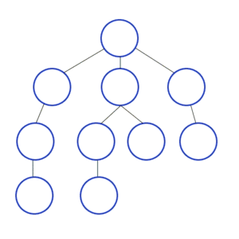

# Решатель пятнашек [](https://travis-ci.com/pryahin/15-Puzzle-solver)

* [Задача](#task)
* [Подходы к решению задачи](#solutions)
  * [Алгоритм А*](#astar)
  * [Алгоритм IDА*](#idastar)
  * [Поиск в ширину](#bfs)
  * [Другие алгоритмы для решения поиска пути на графе](#other)
  * [Выбор алгоритма и сведение к формальной задачe](#consolidation)
* [Формат данных](#dataformat)
  * [Входные данные](#inputdata)
  * [Выходные данные](#outputdata)
* [Реализация](#realization)
  * [Установка](#install)
  * [Запуск](#launch)
  * [Генерация случайного поля](#gentest)
* [Логика программы](#logic)
* [Тесты](#tests)
<hr>


<a name="task"></a>
## Задача
> Постройте программу для решения головоломки «Пятнашки» произвольного размера.
Для обобщённых пятнашек (с бо́льшим, чем 15, количеством костяшек) задача поиска кратчайшего решения для заданной конфигурации является NP-полной [[Источник]](https://users.soe.ucsc.edu/~manfred/pubs/J15.pdf)
(также в этой статье описан упрощенный алгоритм полиномиально-приближенного решения)

<a name="solutions"></a>
## Подходы к решению задачи
«Пятнашки» разных размеров с 1960-х годов регулярно используются в исследованиях в области ИИ; в частности, на них испытываются и сравниваются алгоритмы поиска в пространстве состояний с разными эвристическими функциями и другими оптимизациями, влияющими на число посещённых в процессе поиска конфигураций головоломки (вершин графа).

В качестве алгоритма поиска может использоваться алгоритм A*, IDA*, поиск в ширину.

Головоломка 3 × 3 легко решается любым алгоритмом поиска. Произвольные конфигурации пятнашек 4 × 4 решаются с помощью современных алгоритмов поиска за несколько миллисекунд. Для оптимального решения головоломки 5 × 5 требуются больши́е затраты ресурсов даже с применением современных компьютеров и алгоритмов; процесс поиска может длиться несколько недель и генерировать триллионы узлов. Оптимальное решение произвольных конфигураций головоломки 6 × 6 до сих пор находится за пределами возможностей, в связи с чем в исследованиях делаются лишь попытки предсказать относительную производительность алгоритма IDA* с разными эвристическими функциями.

Одна из самых простых эвристик для пятнашек может быть выражена следующим образом:
`Число ходов, требуемых для решения, не меньше, чем число плиток, находящихся не на своих местах.`

Верность утверждения, то есть допустимость эвристической функции «число плиток, находящихся не на своих местах», следует из того, что за один ход может быть поставлена на место только одна плитка. Эта эвристика не использует всю имеющуюся информацию: например, она не принимает во внимание расстояния, на которые должны быть перемещены отдельные плитки.

Более «умная» эвристика сопоставляет каждому расположению плиток сумму расстояний от текущей позиции каждой плитки до её целевой позиции. В литературе эта эвристика встречается под именем «манхэттенское расстояние» (Manhattan distance). Допустимость функции следует из того, что за один ход перемещается только одна фишка, и расстояние между этой фишкой и её конечной позицией изменяется на 1. Тем не менее, эта эвристика также не использует всю имеющуюся информацию, из-за того, что в одной позиции не могут находиться одновременно две плитки. Существуют более информированные варианты «манхэттенского расстояния», такие, как Linear Conflict.


<a name="astar"></a>
### Алгоритм А*
Поиск A* — в информатике и математике, алгоритм поиска по первому наилучшему совпадению на графе, который находит маршрут с наименьшей стоимостью от одной вершины (начальной) к другой (целевой, конечной).

Порядок обхода вершин определяется эвристической функцией «расстояние + стоимость» (обычно обозначаемой как f(x)). Эта функция — сумма двух других: функции стоимости достижения рассматриваемой вершины (x) из начальной (обычно обозначается как g(x) и может быть как эвристической, так и нет), и функции эвристической оценки расстояния от рассматриваемой вершины к конечной (обозначается как h(x)).

Функция h(x) должна быть допустимой эвристической оценкой, то есть не должна переоценивать расстояния к целевой вершине. Например, для задачи маршрутизации h(x) может представлять собой расстояние до цели по прямой линии, так как это физически наименьшее возможное расстояние между двумя точками.

Этот алгоритм был впервые описан в 1968 году. Это по сути было расширение алгоритма Дейкстры, созданного в 1959 году. Новый алгоритм достигал более высокой производительности (по времени) с помощью эвристики. В их работе он упоминается как «алгоритм A». Но так как он вычисляет лучший маршрут для заданной эвристики, он был назван A*.

A* пошагово просматривает все пути, ведущие от начальной вершины в конечную, пока не найдёт минимальный. Как и все информированные алгоритмы поиска, он просматривает сначала те маршруты, которые «кажутся» ведущими к цели. От жадного алгоритма, который тоже является алгоритмом поиска по первому лучшему совпадению, его отличает то, что при выборе вершины он учитывает, помимо прочего, весь пройденный до неё путь. Составляющая g(x) — это стоимость пути от начальной вершины, а не от предыдущей, как в жадном алгоритме.

В начале работы просматриваются узлы, смежные с начальным; выбирается тот из них, который имеет минимальное значение f(x), после чего этот узел раскрывается. На каждом этапе алгоритм оперирует с множеством путей из начальной точки до всех ещё не раскрытых (листовых) вершин графа — множеством частных решений, — которое размещается в очереди с приоритетом. Приоритет пути определяется по значению f(x) = g(x) + h(x). Алгоритм продолжает свою работу до тех пор, пока значение f(x) целевой вершины не окажется меньшим, чем любое значение в очереди, либо пока всё дерево не будет просмотрено. Из множества решений выбирается решение с наименьшей стоимостью.

#### Оценка сложности 
Временна́я сложность алгоритма A* зависит от эвристики. В худшем случае, число вершин, исследуемых алгоритмом, растёт экспоненциально по сравнению с длиной оптимального пути, но сложность становится полиномиальной, когда эвристика удовлетворяет следующему условию:


где h* — оптимальная эвристика, то есть точная оценка расстояния из вершины x к цели. Другими словами, ошибка h(x) не должна расти быстрее, чем логарифм от оптимальной эвристики.

Но ещё бо́льшую проблему, чем временна́я сложность, представляют собой потребляемые алгоритмом ресурсы памяти. В худшем случае ему приходится помнить экспоненциальное количество узлов.

**Пример работы алгоритма:**


<a name="idastar"></a>
### Алгоритм IDА*
**I**terative **D**eepening **A*** (Алгоритм A* с итеративным углублением) — применение идеи итеративного углубления в контексте эвристического поиска.

Неинформированный алгоритм итеративного углубления останавливает развёртывание, когда глубина поиска d превышает текущий предел глубины l. Информированный алгоритм IDA* останавливает развёртывание, когда оценка f(n) стоимости пути через текущий узел n превышает текущий предел стоимости пути bound.

Алгоритм IDA* отличается минимальными затратами памяти по сравнению с A* и сравнительно малым (в случае удачного выбора эвристики) количеством развёрнутых узлов по сравнению с IDDFS.

<a name="bfs"></a>
### Поиск в ширину
Поиск в ширину работает путём последовательного просмотра отдельных уровней графа, начиная с узла-источника `u`

Рассмотрим все рёбра `(u,v)`, выходящие из узла `u`. Если очередной узел `v` является целевым узлом, то поиск завершается; в противном случае узел v добавляется в очередь. После того, как будут проверены все рёбра, выходящие из узла `u`, из очереди извлекается следующий узел `u`, и процесс повторяется.

**Пример работы алгоритма:**



<a name="other"></a>
### Другие алгоритмы для решения поиска пути на графе
#### Алгоритм Дейкстры

Каждой вершине из V сопоставим метку — минимальное известное расстояние от этой вершины до a. Алгоритм работает пошагово — на каждом шаге он «посещает» одну вершину и пытается уменьшать метки. Работа алгоритма завершается, когда все вершины посещены.

**Инициализация**. Метка самой вершины a полагается равной 0, метки остальных вершин — бесконечности. Это отражает то, что расстояния от a до других вершин пока неизвестны. Все вершины графа помечаются как непосещённые.

**Шаг алгоритма**. Если все вершины посещены, алгоритм завершается. В противном случае, из ещё не посещённых вершин выбирается вершина u, имеющая минимальную метку. Мы рассматриваем всевозможные маршруты, в которых u является предпоследним пунктом. Вершины, в которые ведут рёбра из u, назовём соседями этой вершины. Для каждого соседа вершины u, кроме отмеченных как посещённые, рассмотрим новую длину пути, равную сумме значений текущей метки u и длины ребра, соединяющего u с этим соседом. Если полученное значение длины меньше значения метки соседа, заменим значение метки полученным значением длины. Рассмотрев всех соседей, пометим вершину u как посещённую и повторим шаг алгоритма.

#### Волновой алгоритм
Алгоритм работает на дискретном рабочем поле (ДРП), представляющем собой ограниченную замкнутой линией фигуру, не обязательно прямоугольную, разбитую на прямоугольные ячейки, в частном случае — квадратные. Множество всех ячеек ДРП разбивается на подмножества: «проходимые» (свободные), т. е при поиске пути их можно проходить, «непроходимые» (препятствия), путь через эту ячейку запрещён, стартовая ячейка (источник) и финишная (приемник). Назначение стартовой и финишной ячеек условно, достаточно — указание пары ячеек, между которыми нужно найти кратчайший путь.

Алгоритм предназначен для поиска кратчайшего пути от стартовой ячейки к конечной ячейке, если это возможно, либо, при отсутствии пути, выдать сообщение о непроходимости

<a name="consolidation"></a>
### Выбор алгоритма и сведение к формальной задачe
Представим нашу задачу как граф.

В качестве вершин будут состояния доски, т.е. расположение элементов. Между собой связаны вершины, которые можно получить, путем свижения всего 1-ой ячейки. 

Решением будет вершина, обозначающая cостояние доски, когда все элементы на своих местах.

Для решения данной задачи был выбран [алгоритм A*](#astar). Описание, сложность и пример работы алгоритма описан выше.

Данный алгоритм был выбран т.к. он не тупо обходит все состояния, а выбирает лучший из возможных(в зависимости от эвристики), и переходит в него. 

<a name="dataformat"></a>
## Формат входных/выходных данных
<a name="inputdata"></a>
### Входные данные
Входные данные подаются в виде матрицы размера NxN в формате json
```json
[
  [1,2,3,4],
  [5,6,7,8],
  [9,10,0,12],
  [13,14,11,15]
]
```
<a name="outputdata"></a>
### Выходные данные
Ошибка при неверном формате данных/невозможности решения данной пятнашки
```json
{ 
  "message": "Некорректный формат входных данных"
}
```
Или порядок ходов при найденом решении
```
  1  2  3  4
  5  6  7  8
  9 10  0 12
 13 14 11 15

  1  2  3  4
  5  6  7  8
  9 10 11 12
 13 14  0 15

  1  2  3  4
  5  6  7  8
  9 10 11 12
 13 14 15  0
```

В режиме короткого вывода будет выведена последовательность позиций, на которых находилась пустая клетка(через запятую):
```
11,15,16
```

<a name="realization"></a>
## Реализация

> Реализован алгоритм А*.
>
> У нас есть поле и мы смотрим какие поля могут получиться из текущего.
>
> g(x) = Кол-во ходов сделанных из начального до текущего
>
> h(x) = Суммарный путь, который нужной пройти каждой цифре ходов для того, чтобы она оказалась на своем месте (манхэттенское расстояние)

<a name="install"></a>
### Установка

```
npm install
```


<a name="launch"></a>
### Запуск

```
npm start [--short]
```

<a name="gentest"></a>
### Генерация поля и поиск решения для него:
```
npm run test N M
```

N - Задает поле NxN. По умолчанию = 4.

M - Генерируется решенное поле, и делается M смещений. По умолчанию = 20.

<a name="logic"></a>
## Логика программы
Точка входа программы - index.js. Здесь запускается модуль Reader, для считывания данных со входного потока, либо с файла(переданного через аргументы)
Далее данные подаются в модуль Validator, который, как понятно из названия, проверяет на корректность входные данные.

После проверки на валидность, входные данные передаются в модуль Table. Этот модуль представляет матрицу как игровое поле, с необходимыми для
алгоритма параметрами(g,f,h). В нем реализованы функции:
* moveZero - сдвинуть 0, и вернуть новый экземпляр класса Table, либо null
* nextStages - возвращает массив соседей.
* isSolve - проверяет решение эта таблица или нет
* print - печать таблицы

Далее, входная таблица подается в модуль Solver, который начинает искать решение.
В модуле Solver, смотрятся есть подсчет открытых, и закрытых вершин. 
Закрытые вершины - вершины, которые мы уже посетили.
Открытые вершины - вершины, в которые мы попасть из закрытых вершин. 

Поиск начинается в функции search(). Разобьем ее на следующие шаги:
1. Если 4х4, то проверяется на возможность решения по формуле.
2. Поиск идет, пока есть открытые вершины:
    1. Из открытых вершин берется минимальная, удяляется оттуда, и записывается в закрытые.
    2. Если это решение - вовзвращаем путь, который нужно пройти из начального состояния к конечному
    3. Иначе получаем список соседних вершин.
    4. Если соседа нет ни в закрытых, ни в открытых, то записываем в открытые. Если же уже есть в списке закрытых вершин, 
    то игнорируем, т.к. мы смогли туда дойти за более короткое время. Если сосед есть в списке открытых вершин, то в случе, 
    когда на g меньше - перезаписываем. 


<a name="tests"></a>
## Тесты
Тесты находятся в директории [test](test)
